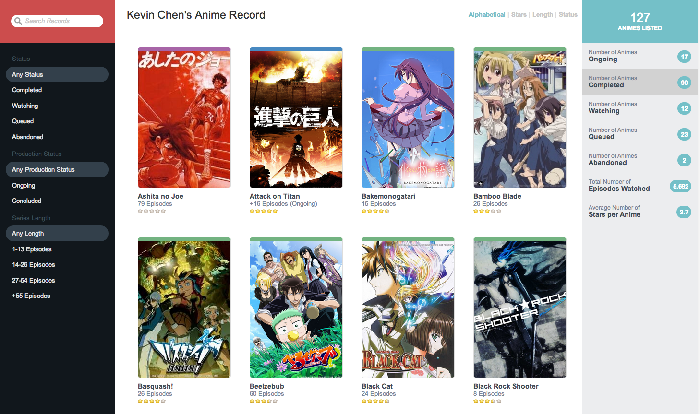

AnimeRecord
===========

A central hub for tracking animes in various states of completion. Designed for inciting collaborative discussion on trending anime preferences for any given anime enthusiast. [Try it now](http://htmlpreview.github.io/?https://github.com/k39chen/AnimeRecord/blob/master/index.html)!

Features
------------
+ Presented with a clean interface for reviewing your favourite/least favourite animes
+ Tracks the state (Ongoing, Completed, Watching, Queued, Abandoned) of any given anime
+ Remembers the last episode that was watched so that you know exactly where to continue
+ Provides in-depth information about the anime (on mouse rollover) for you to share with friends or remind yourself
+ Allows you to sort a given selection of animes for ease of browsing
+ Provides easy to use search filters, and also a search bar that shortlists probable results using typeahead
+ Calculates metrics based on your watching preferences and star ratings

Usage
------------

To preview **AnimeRecord** [click here](http://htmlpreview.github.io/?https://github.com/k39chen/AnimeRecord/blob/master/index.html) or 
simply download the ZIP through git and open the `index.html` in any browser (preferably Chrome).

License
-------------
Copyright (c) 2013 Kevin Chen.

_________________________

**The next iteration of the anime tracking series will improve upon some of the shortcomings in this project. Look forward to the Animatrix. Coming soon!**
